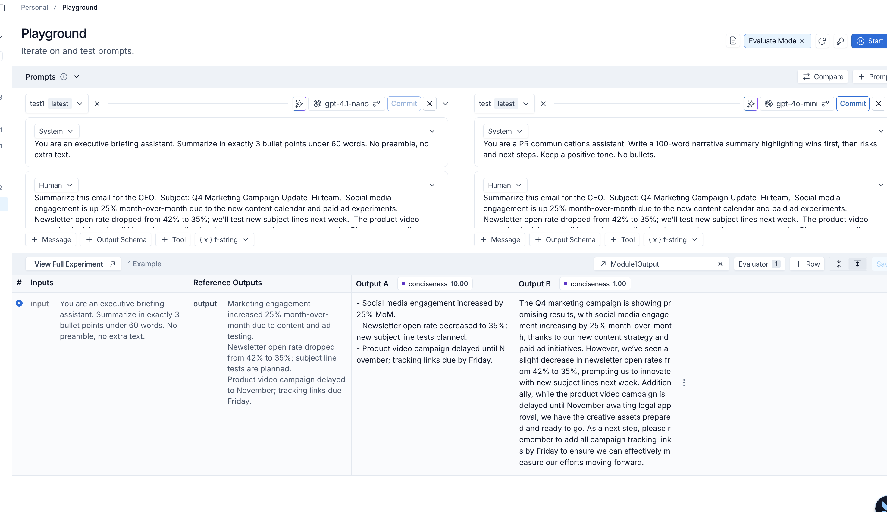
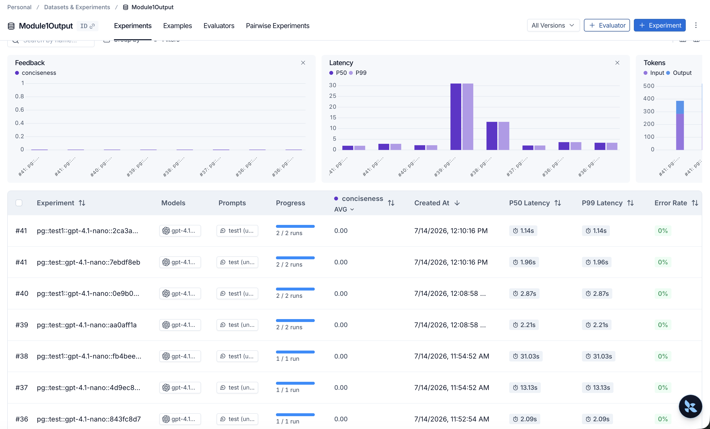

# Module 1 - First LLM-as-a-Judge Evaluation Harness

## Objective

The objective of this exercise was to compare two email-summary prompts, connect the outputs to a LangSmith dataset, attach a Conciseness LLM-as-a-Judge evaluator, and bootstrap a starter evaluation dataset from a cold start.

## Version A - Concise Prompt

```text
You are an executive briefing assistant.
Summarize in exactly 3 bullet points under 60 words. No preamble, no extra text.
```

## Version B - Narrative Prompt

```text
You are a PR communications assistant.
Write a 100-word narrative summary highlighting wins first, then risks and next steps.
Keep a positive tone. No bullets.
```

## Evaluation Setup

- Dataset: `Test1`
- Generator model: `gpt-4.1-nano`
- Generator family/provider: OpenAI
- Evaluator: `Conciseness`
- Evaluation method: LLM-as-a-Judge
- Judge model: `gpt-5.6-terra`
- Judge family/provider: OpenAI
- Score range: 0–10

The evaluator examines whether the output conveys the required information efficiently and without unnecessary wording.

The recommended configuration is to use a judge from a different model family to reduce self-preference bias. In this Module 1 environment, only the OpenAI provider was configured, so a different OpenAI model was used as the judge. A production evaluation would compare this judge with a cross-family judge and human labels before treating its scores as trustworthy.

## Cold-Start Dataset Prompt

```text
Generate 20 evaluation examples for an email summarization benchmark.

For each example include:

- Input email
- Candidate summary
- Human label: Good or Bad
- One sentence explaining why the label was assigned

Requirements:

- Create realistic workplace emails from areas such as engineering, product, marketing, HR, finance, customer support, legal, operations, and sales.
- Create approximately 10 Good and 10 Bad examples.
- Good summaries must be factually correct, concise, preserve priorities, and include important actions and deadlines.
- Bad summaries should contain at least one failure such as missing critical information, hallucinated facts, excessive verbosity, misleading wording, incorrect priorities, or missing action items.

Return everything as a markdown table.
```

The generated starter rows are stored in:

```text
01-evaluation-strategy/starter-email-dataset.md
```

## Definition of Good vs. Bad

### Good Summary

A summary is labeled Good when it:

1. Accurately represents the source email without changing its meaning.
2. Includes decision-critical facts.
3. Includes important actions, owners, deadlines, dependencies, and exceptions.
4. Preserves the urgency and priority of the source.
5. Uses concise language appropriate for an executive reader.
6. Does not introduce unsupported information.
7. Avoids unnecessary background, repetition, and commentary.

Minor supporting details may be omitted when they do not affect a decision or action.

### Bad Summary

A summary is labeled Bad when it:

1. Omits a critical action, deadline, owner, risk, dependency, or exception.
2. Introduces unsupported or hallucinated information.
3. Changes factual details such as dates, amounts, status, scope, or severity.
4. Presents a conditional outcome as certain.
5. Changes the intent or priority of the source email.
6. Is excessively verbose, vague, or difficult to scan.
7. Emphasizes minor details while hiding the most important information.

A summary is considered materially bad when it could cause a reader to make an incorrect decision or miss a required action.

## Human Curation

The initial rows and labels were generated by an LLM only to solve the cold-start problem. I manually reviewed the rows against the labeling criteria rather than accepting the model-generated labels as ground truth.

This remains a starter dataset, not a production golden dataset. Further work would include:

- Adding more difficult and ambiguous examples.
- Including longer emails and conflicting priorities.
- Reviewing labels with multiple human annotators.
- Measuring inter-annotator agreement.
- Calibrating the LLM judge against human labels.
- Tracking judge consistency and failure modes.

## Evidence

### LangSmith evaluation setup



### Starter dataset rows


